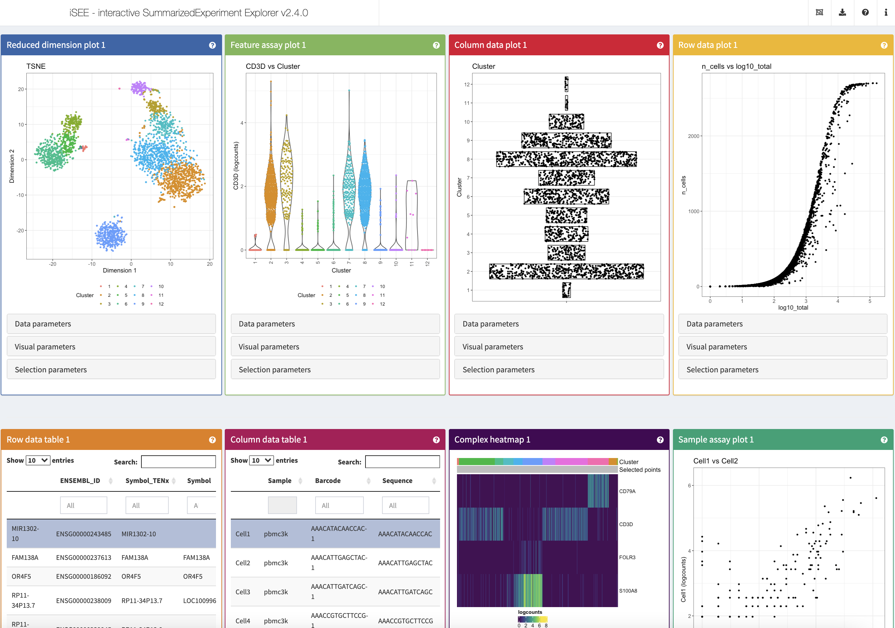
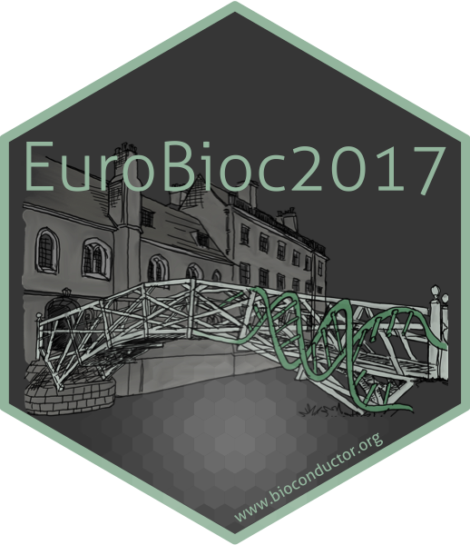
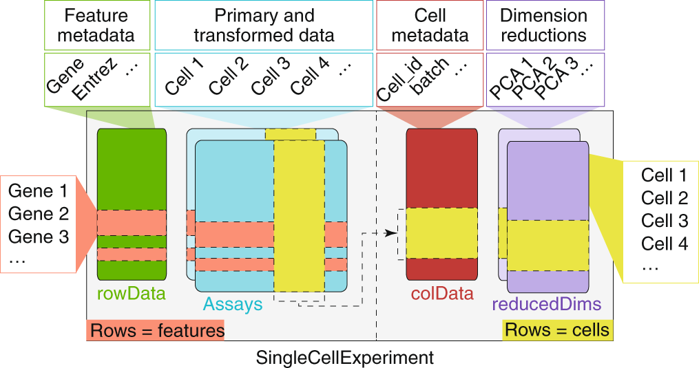
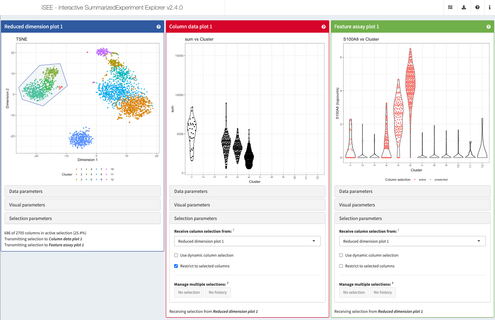

layout: true

<div class="my-header"></div>

<div class="my-footer"><span>
Interactive And Collaborative Exploration Of Large-Scale Transcriptomics Data With iSEE
</span></div>

```{r setup, include=FALSE}
# Dependencies
stopifnot(requireNamespace("htmltools"))
stopifnot(requireNamespace("knitr"))
stopifnot(require(RefManageR))
# htmltools
htmltools::tagList(rmarkdown::html_dependency_font_awesome())
# knitr options
knitr::opts_chunk$set(
  echo = FALSE
)
# RefManager
BibOptions(
  check.entries = FALSE,
  bib.style = "authoryear",
  cite.style = "authoryear",
  max.names = 3,
  style = "markdown",
  hyperlink = "to.doc",
  dashed = TRUE,
  longnamesfirst = FALSE)
bib <- ReadBib("references.bib")
```

---

# iSEE

```{r}

```

---

# `r fontawesome::fa("medal", position = "static")` Winners of the 1st Rstudio Shiny Contest

```{r, fig.align='center', out.height='300px'}

```

.center[
_"Most technically impressive"_
]

.footnote[
Read more: <https://blog.rstudio.com/2019/04/05/first-shiny-contest-winners/>
]

---

# <i class="fas fa-users"></i> Team effort

<br/>

<table>
<tr>
<td width="25%"><a href="https://kevinrue.github.io"></a></td>
<td width="25%"><a href="https://csoneson.github.io"></a></td>
<td width="25%"><a href="https://federicomarini.github.io"></a></td>
<td width="25%"><a href="https://orcid.org/0000-0002-3564-4813"></a></td>
</tr>
<tr>
<td align='center' width="25%">Kevin</td>
<td align='center' width="25%">Charlotte</td>
<td align='center' width="25%">Federico</td>
<td align='center' width="25%">Aaron</td>
</tr>
</table>

.center[


]

---

# Bioconductor

.pull-left[
## Release 3.13 (April 2021)

- 2042 software packages
- 406 experiment data packages
- 965 annotation packages
- 29 workflows

<https://bioconductor.org/>


.center[

]
]

.pull-right[
```{r, out.height='450px'}
knitr::include_graphics("img/osca.fig3.workflow.png")
```

.small-p[
[Orchestrating single-cell analysis with Bioconductor](https://doi.org/10.1038/s41592-019-0700-8)
`r Citep(bib, "amezquita2020osca")`
]
]

---

# SingleCellExperiment

```{r}

```

.small-p[
[Orchestrating single-cell analysis with Bioconductor](https://doi.org/10.1038/s41592-019-0700-8)
`r Citep(bib, "amezquita2020osca")`
]

---

# Transmitted selections 

```{r}

```

---

# Contact

.pull-left[
.center[

]

`r fontawesome::fa("github", fill = "black", position = "static")` [kevinrue](https://kevinrue.github.io)

`r fontawesome::fa("twitter", fill = "#1da1f2", position = "static")` [KevinRUE67](https://twitter.com/KevinRUE67)

`r fontawesome::fa("linkedin", fill = "#0e76a8", position = "static")` [kevin-rue-albrecht](https://www.linkedin.com/in/kevin-rue-albrecht/)
]

.pull-right[
.center[

]

`r fontawesome::fa("slack", fill = "black", position = "static")`
The [#isee](https://community-bioc.slack.com/archives/C8BJLSP8T) Bioconductor Slack channel

`r fontawesome::fa("github", fill = "black", position = "static")`
This presentation on [GitHub](https://isee.github.io/iSEEWorkshopEuroBioc2020Slides/#1)

`r fontawesome::fa("github", fill = "black", position = "static")`
The EuroBioC 2020 Workshop on [GitHub](https://isee.github.io/iSEEWorkshopEuroBioc2020)

`r fontawesome::fa("github", fill = "black", position = "static")`
The iSEE [GitHub organization](https://github.com/iSEE)
]

---

# References

.small-text[
```{r, include=TRUE, echo=FALSE, results="asis"}
NoCite(bib, "rue2018isee")
NoCite(bib, "amezquita2020osca")
PrintBibliography(bib)
```
]

.center[

]
