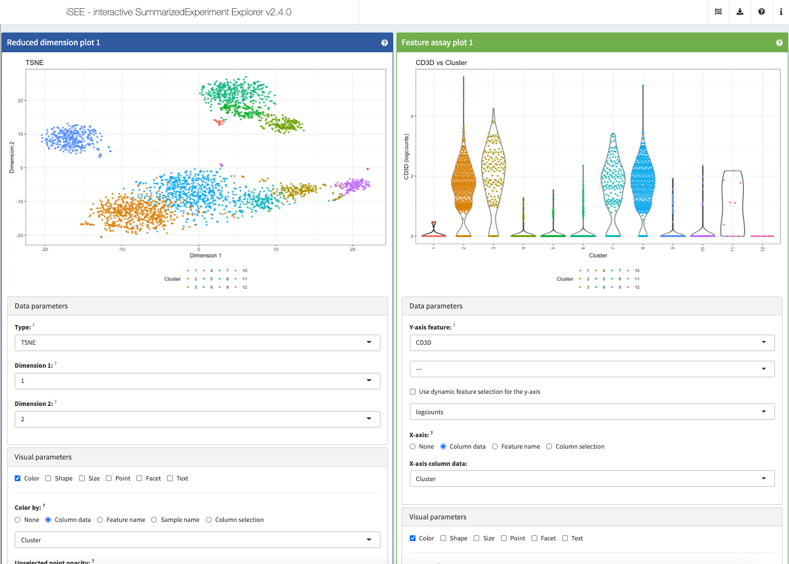
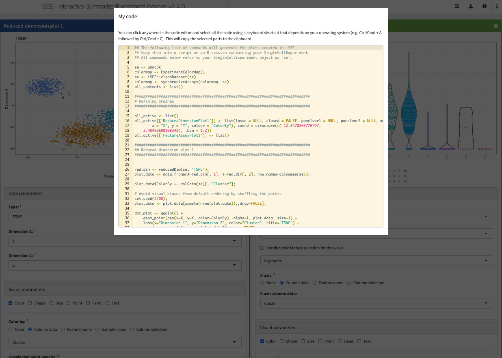
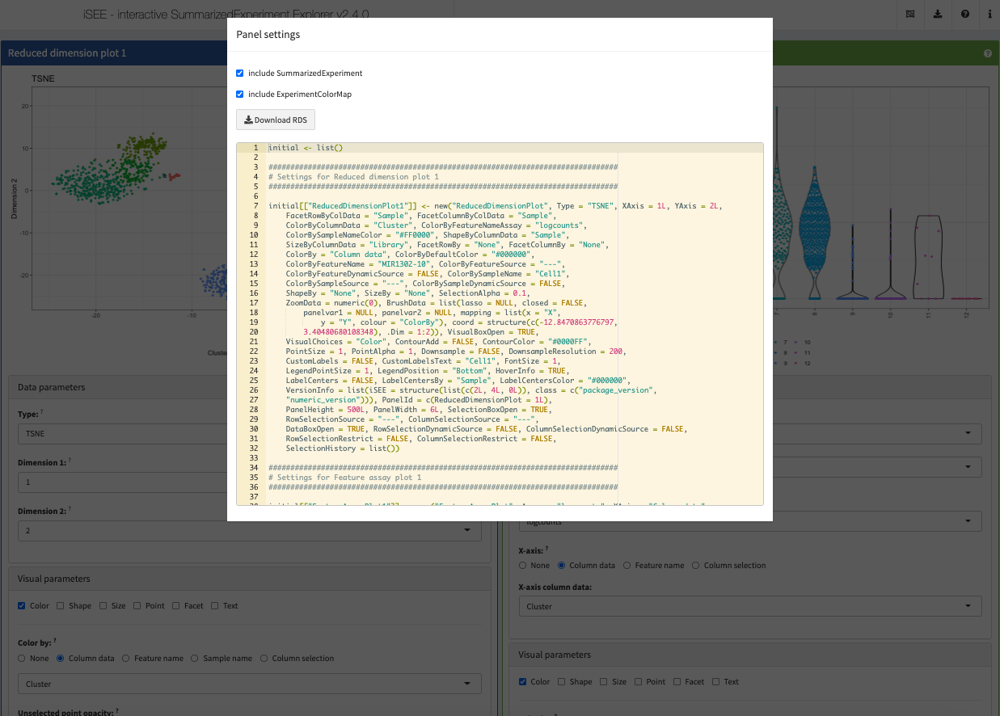
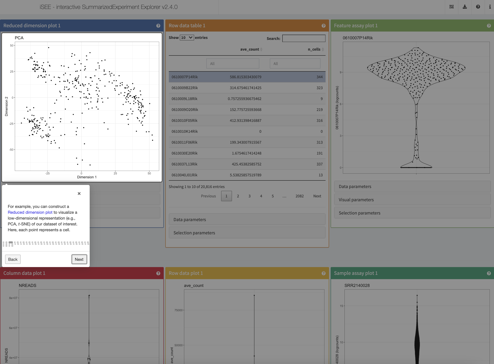
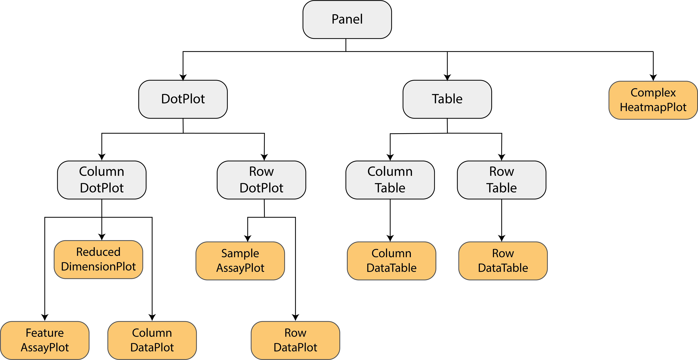
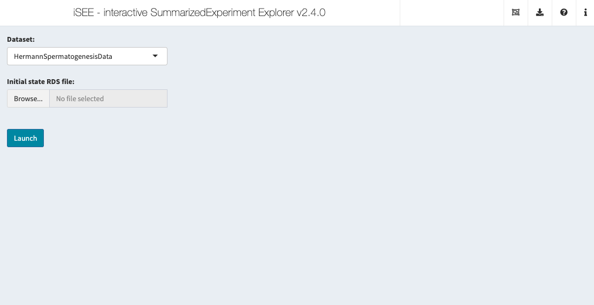

layout: true

<div class="my-header"><a href="https://bioconductor.org/packages/iSEE/"></a></div>

<div class="my-footer"><span>
Interactive And Collaborative Exploration Of Large-Scale Transcriptomics Data With iSEE
</span></div>

```{r setup, include=FALSE}
# Dependencies
stopifnot(requireNamespace("htmltools"))
stopifnot(requireNamespace("knitr"))
stopifnot(require(RefManageR))
# htmltools
htmltools::tagList(rmarkdown::html_dependency_font_awesome())
# knitr options
knitr::opts_chunk$set(
  echo = FALSE
)
# RefManager
BibOptions(
  check.entries = FALSE,
  bib.style = "authoryear",
  cite.style = "authoryear",
  max.names = 3,
  style = "markdown",
  hyperlink = "to.doc",
  dashed = TRUE,
  longnamesfirst = FALSE)
bib <- ReadBib("references.bib")
```

---

# iSEE

```{r}
knitr::include_graphics("img/pbmc3k-prettified.png")
```

---

# `r fontawesome::fa("medal", position = "static")` Winners of the 1st RStudio Shiny Contest

```{r, fig.align='center', out.height='300px'}
knitr::include_graphics("img/shiny-contest.png")
```

.center[
_"Most technically impressive"_
]

.footnote[
Read more: <https://blog.rstudio.com/2019/04/05/first-shiny-contest-winners/>
]

---

# <i class="fas fa-users"></i> Team effort

<br/>

<table>
<tr>
<td width="25%"><a href="https://kevinrue.github.io"></a></td>
<td width="25%"><a href="https://csoneson.github.io"></a></td>
<td width="25%"><a href="https://federicomarini.github.io"></a></td>
<td width="25%"><a href="https://orcid.org/0000-0002-3564-4813"></a></td>
</tr>
<tr>
<td align='center' width="25%">Kevin</td>
<td align='center' width="25%">Charlotte</td>
<td align='center' width="25%">Federico</td>
<td align='center' width="25%">Aaron</td>
</tr>
</table>

.center[
<a href="https://bioconductor.org/">

</a>
<a href="https://bioconductor.github.io/EuroBioc2017/">

</a>
]

---

# Bioconductor

.pull-left[
## Release 3.13 (April 2021)

- 2042 software packages
- 406 experiment data packages
- 965 annotation packages
- 29 workflows

<https://bioconductor.org/>


.center[

]
]

.pull-right[
```{r, out.height='450px'}
knitr::include_graphics("img/osca.fig3.workflow.png")
```

.small-p[
[Orchestrating single-cell analysis with Bioconductor](https://doi.org/10.1038/s41592-019-0700-8)
`r Citep(bib, "amezquita2020osca")`
]
]

---

# SingleCellExperiment

```{r}
knitr::include_graphics("img/osca.fig2.sce.png")
```

.small-p[
[Orchestrating single-cell analysis with Bioconductor](https://doi.org/10.1038/s41592-019-0700-8)
`r Citep(bib, "amezquita2020osca")`
]

---

# SingleCellExperiment & iSEE

```{r, out.height='500px', fig.align='center'}
knitr::include_graphics("img/osca-sce-isee.png")
```

---

# Parameter boxes

```{r}

```

---

# Transmitted selections 

```{r}
knitr::include_graphics("img/pbmc3k-selection.png")
```

---

# Code tracker

```{r}

```

---

# Panel settings

```{r}

```

---

# Preconfigured applications

.pull-left[
## Define the initial state

```{r, echo=TRUE, eval=FALSE}
initial <- list(
    ReducedDimensionPlot(
        PanelWidth = 6L,
        Type = "TSNE",
        ColorByColumnData = "Cluster"
    )
)
```
]

.pull-right[
## Alternatively

Use the panel settings exported from a past session.
]

## Configure the app and launch!

```{r, echo=TRUE, eval=FALSE}
app <- iSEE(pbmc3k, initial = initial)
shiny::runApp(app)
```

---

# Guided tours

```{r}

```

---

# Developing new panels

```{r}

```

.right[
`AggregatedDotPlot`, `DynamicMarkerTable`, `DynamicReducedDimensionPlot`, ...
<a href="https://bioconductor.org/packages/iSEEu/">

</a>
]

---

# Custom landing pages

```{r}

```

---

# More

- Not only single-cell transcriptomics, but any rectangular experimental data set, e.g.
  
  + bulk assays (e.g., RNA-seq, ChIP-seq)

  + microarray
  
  + flow cytometry
  
  + ...

<br/>

- Voice recognition, with `iSEE(..., voice = TRUE)`

<br/>

- Online book [Extending iSEE](https://isee.github.io/iSEE-book/)

---

# References

.small-text[
```{r, include=TRUE, echo=FALSE, results="asis"}
NoCite(bib, "rue2018isee")
NoCite(bib, "amezquita2020osca")
PrintBibliography(bib)
```
]

.center[
<a href="https://bioconductor.org/packages/iSEE/">

</a>
]

---

# Contact

.pull-left[
.center[

]

`r fontawesome::fa("github", fill = "black", position = "static")` [kevinrue](https://kevinrue.github.io)

`r fontawesome::fa("twitter", fill = "#1da1f2", position = "static")` [KevinRUE67](https://twitter.com/KevinRUE67)

`r fontawesome::fa("linkedin", fill = "#0e76a8", position = "static")` [kevin-rue-albrecht](https://www.linkedin.com/in/kevin-rue-albrecht/)
]

.pull-right[
.center[
<a href="https://bioconductor.org/packages/iSEE/">

</a>
]

`r fontawesome::fa("slack", fill = "black", position = "static")`
The [#isee](https://community-bioc.slack.com/archives/C8BJLSP8T) channel of the Bioconductor Slack workspace.
Join [here](https://bioc-community.herokuapp.com/)!

`r fontawesome::fa("github", fill = "black", position = "static")`
The iSEE GitHub organization at
<https://github.com/iSEE>

]

<br/>
<br/>
<br/>
<br/>
<br/>
<br/>

.center[
This presentation on GitHub at

<https://kevinrue.github.io/xaringan_nextgen_omics_2021/>
]
